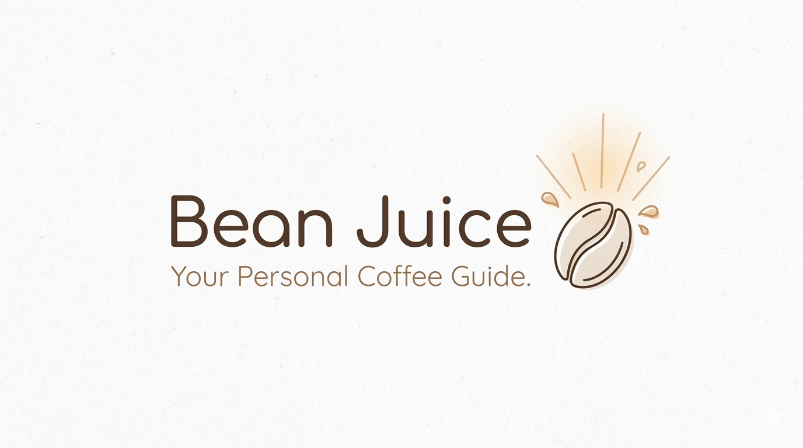

  
  <h1>Bean Juice</h1>
  
  

    Coffee recommendation system based on your favourite coffee beans
  

 

<!-- Badges -->

## Tools

---

 

<!-- Table of Contents -->

# :notebook_with_decorative_cover: Table of Contents

- [About the Project](#star2-about-the-project)
- [Details on Data](#bookmark_tabs-details-on-data)
- [Contact](#handshake-contact)
- [Acknowledgements](#gem-acknowledgements)

<!-- About the Project -->

## :star2: About the Project

A production-grade RAG application that recommends specialty coffee. Project used to learn Langchain library

## :bookmark_tabs: Details on Data

Data is scraped from [Coffee Review](https://coffeereview.com). Each review is stored as a JSON entry collated in a single JSON file.

<u>Other Sources</u>

- [Older coffeereviews.com data](https://www.kaggle.com/datasets/patkle/coffeereviewcom-over-7000-ratings-and-reviews)
- [Another older coffeereviews.com data](https://www.kaggle.com/datasets/schmoyote/coffee-reviews-dataset)

## :handshake: Contact

Author: Martin Ho

Project Link: 

<!-- Acknowledgments -->

## :gem: Acknowledgements

- Badges: [alexandresanlim](https://github.com/alexandresanlim/Badges4-README.md-Profile) & [Ileriayo](https://github.com/Ileriayo/markdown-badges?tab=readme-ov-file#table-of-contents)
